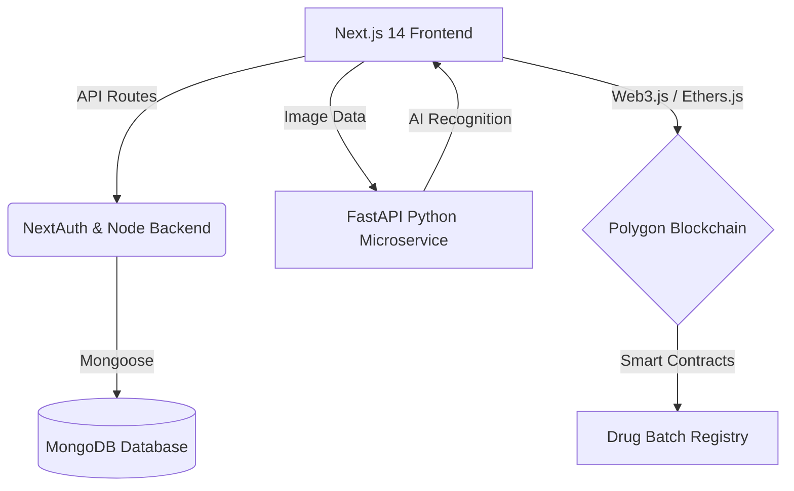

<div align="center">

<!-- Animated Header -->


<!-- Typing Animated Subtitle -->
<a href="https://github.com/SaiyamJain468/Medchain-AI">
  
</a>

<br/>

<!-- Badges -->
<p align="center">
  
  
  
  
  
  
  
</p>

<h3>Revolutionizing Healthcare Supply Chains with Blockchain & Artificial Intelligence.</h3>

</div>

---

## 🚀 Overview

**MedChain AI** is a state-of-the-art decentralized application built to tackle counterfeit drugs and streamline the medical supply chain. By integrating robust **Polygon Blockchain** smart contracts with a **FastAPI-powered Python AI Microservice** and a sleek **Next.js 14** web interface, MedChain AI delivers unprecedented transparency, immutability, and intelligence to the pharmaceutical industry.

<br/>

<div align="center">
  
</div>

## ✨ Key Features

- 🔐 **Role-Based Authentication**: Secure login via NextAuth.js for Patients, Pharmacists, and Admins.
- 💊 **Medicine Scanner**: Real-time barcode & image recognition via an AI microservice and WebRTC.
- ⛓️ **Blockchain Immutability**: Drug batches are registered on the Polygon Testnet through Solidity smart contracts.
- 🗺️ **Fraud Detection Heatmap**: Interactive map visualizing suspected counterfeit incidents using Mapbox GL JS.
- 🛒 **Decentralized Marketplace**: Browse, verify, and trace the history of medical supplies seamlessly.
- 🎨 **Premium UI/UX**: A dark-themed, glassmorphic design utilizing Tailwind CSS for an optimal user experience.

<br/>

<div align="center">
  
</div>

## 🏗️ Technical Architecture



<br/>

## 💻 Installation & Setup

Follow these steps to run **MedChain AI** locally:

### 1. Clone the Repository
```bash
git clone https://github.com/SaiyamJain468/Medchain-AI.git
cd Medchain-AI
```

### 2. Install Dependencies
```bash
npm install
# or
yarn install
```

### 3. Environment Variables
Create a `.env.local` file in the root directory and add the necessary tokens:
```env
NEXTAUTH_SECRET=your_secret_here
MONGODB_URI=your_mongodb_connection_string
MAPBOX_ACCESS_TOKEN=your_mapbox_token
NEXT_PUBLIC_POLYGON_RPC_URL=your_polygon_testnet_rpc
```

### 4. Run the Development Server
```bash
npm run dev
# or
yarn dev
```
Open [http://localhost:3000](http://localhost:3000) to view the application in the browser.

<br/>

<div align="center">
  
</div>

## 🤝 Contributing

We welcome contributions to make **MedChain AI** even better! 
Please see our [CONTRIBUTING.md](CONTRIBUTING.md) for detailed guidelines.
Before you contribute, ensure you read our [Code of Conduct](CODE_OF_CONDUCT.md).

<br/>

## 📜 License

This project is licensed under a **Proprietary License** - see the [LICENSE](LICENSE) file for details. 
Copyright (c) 2026 Saiyam Jain

<br/>

---
<div align="center">
  <i>Developed with ❤️ by <a href="https://github.com/SaiyamJain468">Saiyam Jain</a></i><br>
  
</div>
